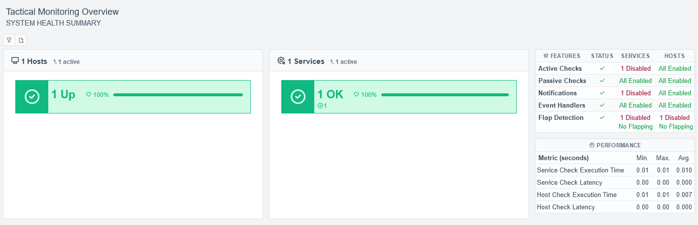
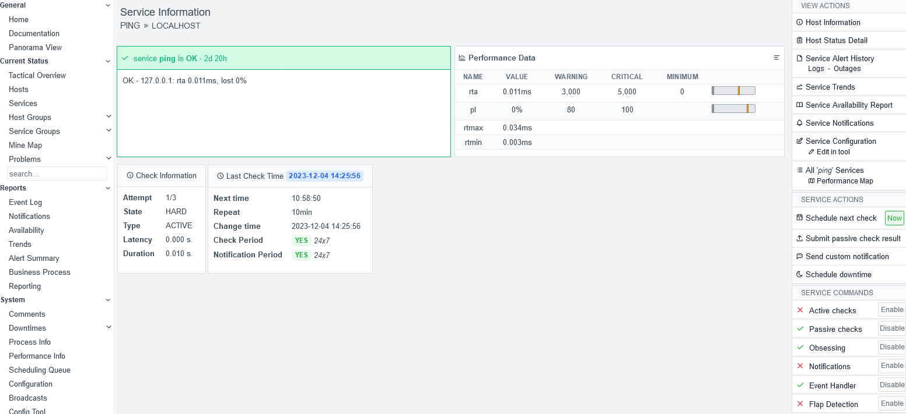
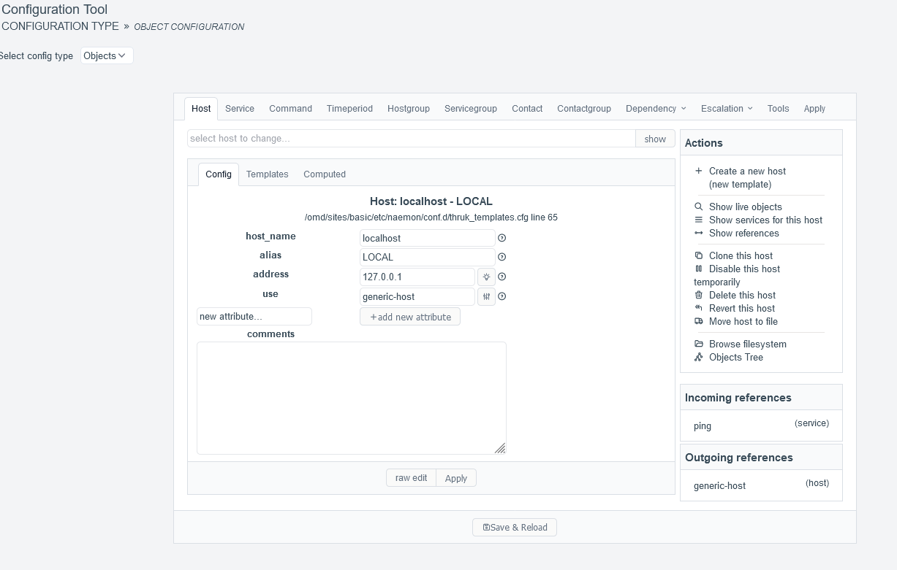
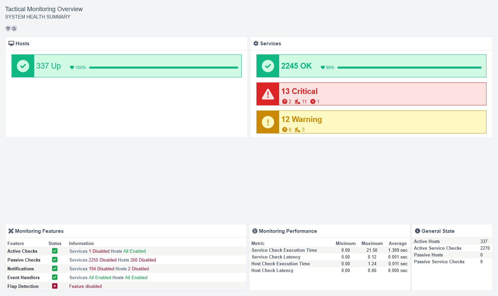
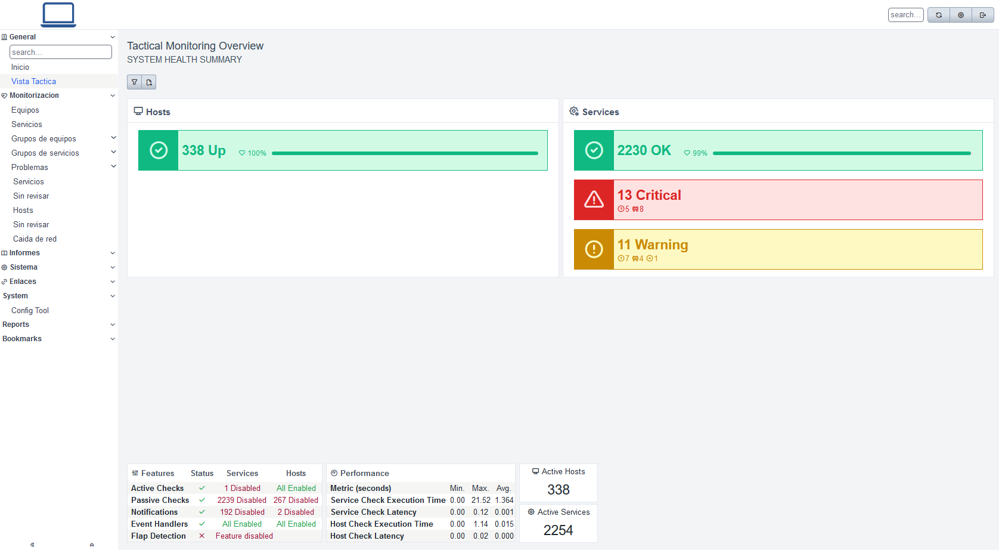
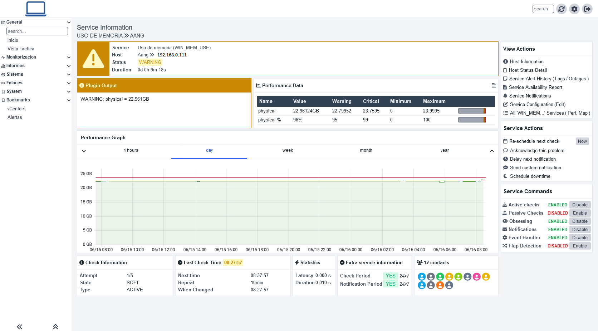

# thruk3-templates
Modified templates for a better visual experience

## Description
This template rearranges html page objects like service/host info.
It has been created trying not to modify too much the default Light/Dark themes (only added a few tailwind basic classes)\
Changed default font to tabler-icons.css\
If you want to use unicons all over thruk instead of fontawesome, try my script in https://github.com/jjcamarasa/thruk3-tt-utils
Latest version uses lots of classes from [tabler.css](https://github.com/tabler) and needs the included Light.css (if not used, some dialog boxes may break functionality or do not show as expected)

## How to test/use it
Backup, backup and backup your themes/templates!\
After that, copy in etc/thruk/templates (wherever it is), and restart thruk service or wait for this service to reload templates.\
Add additional css classes to the end of the theme you ar using at path: etc/thruk/themes/themes-available/stylesheets

## Disclaimer
I'm not a frontend developer, I have tested it in virtual environment, when it looks ok, I made backups and put it in production.\
I'm not responsible for any damage made to your environment (what could be go really bad? It's only css and html)\
If you have any idea or suggestion, make it, fork this repository or do whatever you want.

## Screenshots 
### Tactical Overview - latest version

### Service

### Config Tool

### Older Versions
#### Tactical Overview - 1.1-pre version

#### Tactical Overview - 1.0-pre version

#### Service View 

## Resources used
- [Tabler Icons](https://tabler-icons.io/)
